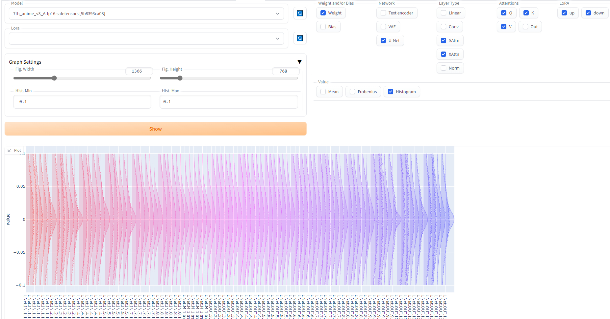
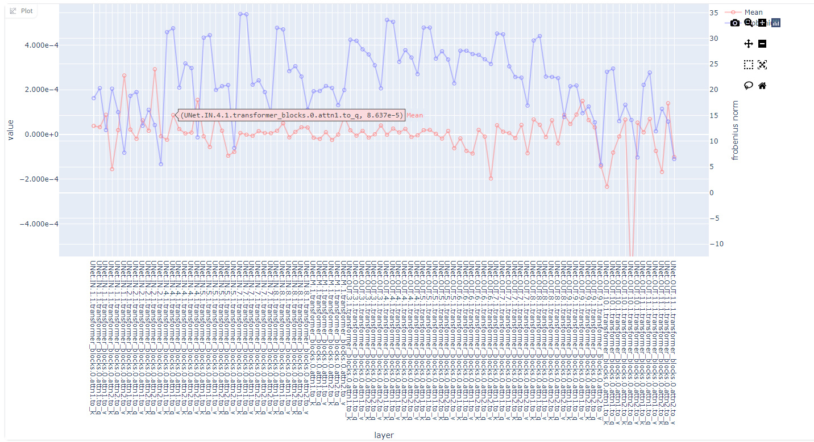
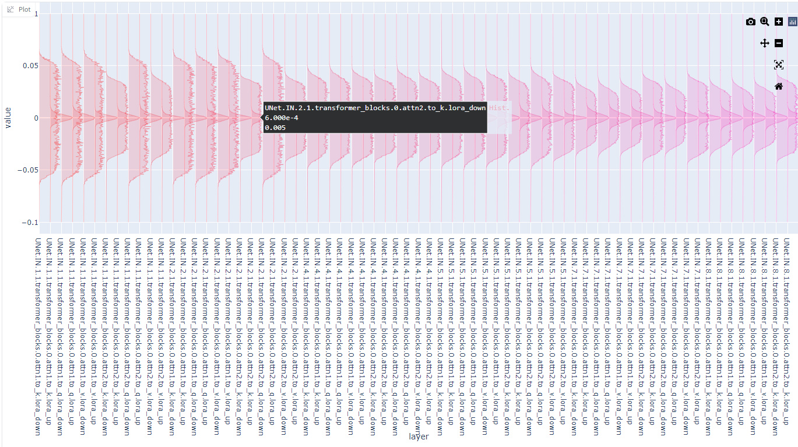

# MatView - Matrix Viewer for Stable Diffusion

## What is this?

This is an extension for [stable-diffusion-webui](https://github.com/AUTOMATIC1111/stable-diffusion-webui) which visualizes model's matrix.

## Example

### Histogram

### Mean and Frobenius norm

### LoRA

